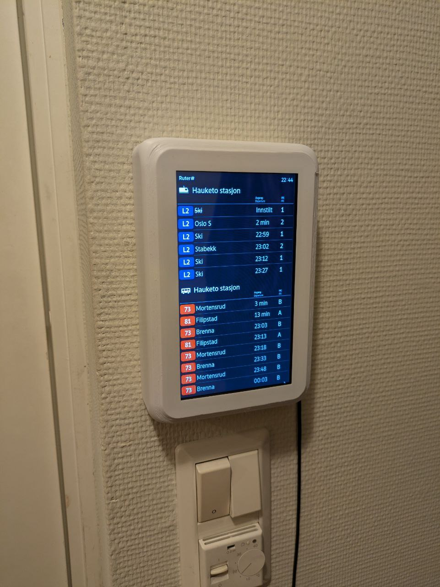

# 🚉 RuterScreen

> ⚠️ **This repository is archived and no longer maintained.**
>
> After evaluation, a second-hand Android tablet running in kiosk mode was found to be a more practical and cost-effective solution compared to a Raspberry Pi with a dedicated screen. The hardware cost and setup complexity of the Pi-based approach did not justify the benefits. If you are looking for a similar solution, consider using an Android tablet with a kiosk browser app pointed at [mon.ruter.no](https://mon.ruter.no/) or [Entur Tavla](https://tavla.entur.no/).
>
> The code is preserved here for reference.

A Raspberry Pi-powered display for showing real-time public transport timetables in Oslo/Viken.

> **Note:** **Weather display is now added!** You can choose to show weather information alongside your public transport timetable using the combined display mode.

The setup script will guide you through configuring:
1. 🖥️ Display mode (timetable-only or combined weather+timetable)
2. 🔗 Your Ruter stop URL
3. 🌤️ Your weather location ID (if using combined mode)
4. 🔆 Display brightness levels
5. 👋 Motion detection settings (if using PIR sensor)
6. 🔄 Screen orientation
7. 🚀 Auto-start settings

### 🌤️ Weather Widget Configuration

For the weather widget, you'll need to:
1. Visit [weatherwidget.org](https://weatherwidget.org/)
2. Search for your city and copy the location ID (e.g., "wl8757" for Oslo)
3. Choose between Oslo (pre-configured) or enter your custom location ID during setup

### 🌤️ Quick Display Configuration

If you want to change the display mode or weather location ID without running the full setup, you can use:
```bash
./scripts/update_weather.sh
```

This script allows you to:
- Switch between timetable-only and combined display modes
- Update the weather location ID (for combined mode)
- Quick access to Oslo or custom location configuration. This project combines hardware and software to create an always-on display that shows public transport departures from your chosen stop in Oslo/Viken, Norway.



## 📋 Overview

RuterScreen provides a dedicated display for Ruter's public transport timetables with optional integrated weather forecast, featuring automatic screen dimming when no one is around to save energy and extend display life. Choose between a full-screen timetable display or a combined layout with weather information in the top portion and Ruter timetables in the main area below.

## 🔄 Data Source

This project uses [Ruter's MonitorScreen service](https://mon.ruter.no/) as the primary data source. This provides a clean, minimalist display perfect for smaller screens.

### 🔄 Alternative Data Source

An alternative source is [Entur's Tavla](https://tavla.entur.no/), which offers:
- 🗺️ Coverage for all of Norway (not just Oslo & Viken)
- ⚙️ More customization options
- 🚢 Additional transport types (including ferries and flights)

However, Tavla requires:
- 👤 User registration for custom views
- 📱 More screen space (their logo takes significant space on a 7" display)

You can modify this project to use Tavla instead of mon.ruter.no if you prefer their features. The setup script will guide you through configuring either option.

## ✨ Features
- 🚍 Real-time display of Ruter timetables from any stop
- 🌤️ Optional integrated weather widget from weatherwidget.org
- 📱 Flexible display modes: timetable-only or combined weather+timetable
- 👋 Motion-activated display with automatic dimming
- 🔆 Customizable brightness levels and timeout settings
- 🔄 Auto-refresh to keep timetable alive in the case of an internet outage or ruter servers downtime
- 🚀 Auto-start on boot

## 🚀 Quick Start

1. 🛠️ [Build the hardware](stl/BUILD.md) using the 3D printable case
2. 📥 Clone this repository:
   ```bash
   git clone https://github.com/yourusername/RuterScreen.git
   cd RuterScreen
   ```
3. ⚙️ Run the setup script:
   ```bash
   ./setup.sh
   ```
4. 📝 Follow the interactive prompts to configure your display

## 💻 Software Components

### 📜 Core Scripts
- `setup.sh` - Interactive configuration script
- `scripts/brightness.sh` - Controls display brightness
- `scripts/motion_brightness.py` - Handles motion detection and auto-dimming
- `scripts/launchSite.sh` - Manages the display of the Ruter timetable (with optional weather widget)
- `display.html` - Combined layout for weather widget + timetable display
- `display-timetable-only.html` - Full-screen timetable layout

### ⭐ Features
- **👋 Motion Detection**: Automatically dims/brightens the display based on presence
- **🔄 Auto-refresh**: Keeps the timetable current without manual intervention
- **⚙️ Configurable Settings**: Easily adjust brightness, timeout, and other parameters

## ⚙️ Configuration

The setup script will guide you through configuring:
1. �️ Display mode (timetable-only or combined weather+timetable)
2. �🔗 Your Ruter stop URL
3. 🌤️ Your preferred weather service URL (if using combined mode)
4. 🔆 Display brightness levels
5. 👋 Motion detection settings (if using PIR sensor)
6. 🔄 Screen orientation
7. 🚀 Auto-start settings

### 🌤️ Quick Display Configuration

If you want to change the display mode or weather service URL without running the full setup, you can use:
```bash
./scripts/update_weather.sh
```

This script allows you to:
- Switch between timetable-only and combined display modes
- Update the weather service URL (for combined mode)
- Quick access to popular weather services

## 🛠️ Hardware Requirements

- 🖥️ Raspberry Pi (3B+, 4, or newer recommended) running Raspberry Pi OS with labwc Wayland compositor 
    - *This was the default option when i installed the OS, the other window managers had weird bugs when rotating a touch screen*
> ⚠️ I used a Raspberry Pi 2B since i had one laying arround but I would discurage using it since you have to then get a usb wifi antenna and configure it to work. It took actual hours to compile the wifi driver since the 2b is so slow. 
- 📺 [7-inch DSI LCD Display](https://aliexpress.com/item/1005006739026067.html)
- 👋 PIR Motion Sensor, [model HC-SR501](https://aliexpress.com/item/32824574702.html) (optional)
- 🖨️ 3D printed case (see [Build Instructions](stl/BUILD.md))
- 🔩 M3 and M2.5 screws detailed in the Build instructions.

## 📝 Todo
- 🖱️ Disable cursor being displayed
    - **⚠️ Blocked** until rapberry pi os updates to a version of labwc that includes this change https://github.com/labwc/labwc/pull/2633
- 🎥 Add a gif of the screen going from black to lit as the main image of this readme.

## 🤝 Contributing

Contributions are welcome! Please feel free to submit a Pull Request.

## 💬 Support

If you encounter any issues:
1. 📝 Open an issue on GitHub
2. ℹ️ Include your configuration and any relevant error messages

## 📄 License

This project is licensed under the **Creative Commons Attribution-NonCommercial-ShareAlike 4.0 International** (CC BY-NC-SA 4.0).  
This means you are free to **modify and share** this work, but **commercial use is not allowed**.  

[Read the full license here](https://creativecommons.org/licenses/by-nc-sa/4.0/).
