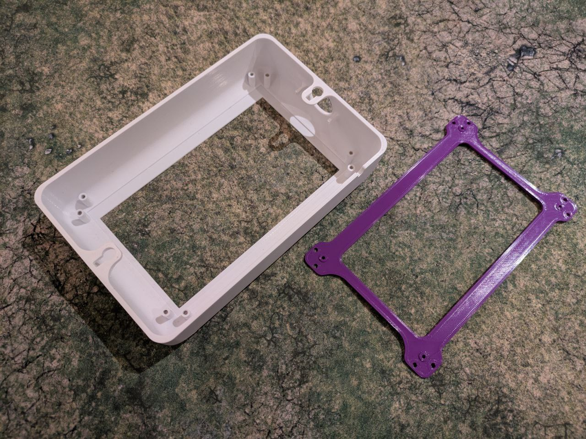
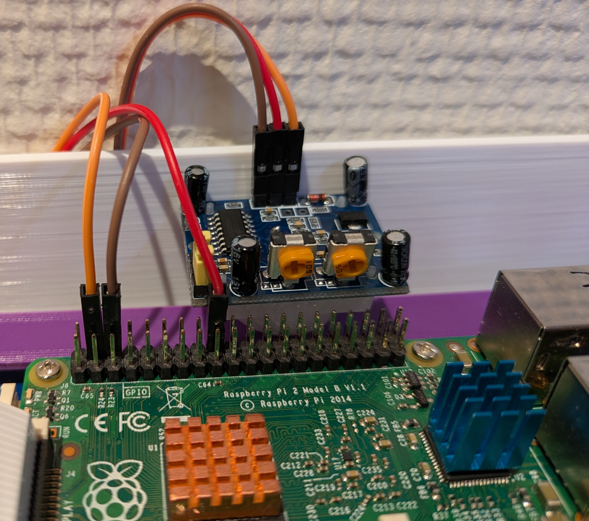
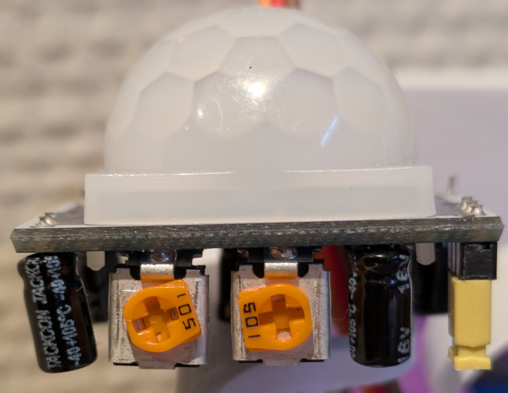
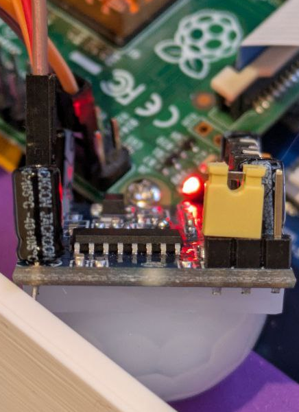

# 🛠️ Build Instructions - RuterScreen

This guide will walk you through the process of assembling your RuterScreen using the provided 3D printed parts and hardware components.

## 📦 Components Required

### 🖨️ 3D Printed Parts
- 1x Case-Pir or Case-NoPir, depending if you want to use a motion sensor or not.
- 1x Midframe to clap the screen onto the case.
- (Optional) Up to 12 Bushings. If you get screws that are too long like me you can print bushings for the relevant screws.



### 🔧 Hardware
- 🖥️ Raspberry Pi (3B+, 4, or newer recommended)
- 📺 [7-inch DSI LCD Display](https://aliexpress.com/item/1005006739026067.html)
- 👋 PIR Motion Sensor, [model HC-SR501](https://aliexpress.com/item/32824574702.html) (optional)
    - 🔌 3x Female to Female jumper wires 15cm lenght is more than enough.
- 🖨️ 3D printed case (see [Build Instructions](stl/BUILD.md))
- 🔩 8x M3 screws *Could use just 4 if you want but they usually come in big packs so might as well keep it secure*
    - 7mm long, i used 12mm but then printed bushings.
- 🔩 4x M2.5 screws, this is what the back of the screen uses. 
    - 7mm long, i used 12mm but then printed bushings.


## 🖨️ Printing Guidelines

Printing all the parts uses less than 160g of plastic.

### Recommended Print Settings
- **Material**: PLA
- **Nozzle Size**: 0.4mm
- **Wall Count**: 4 lines
- **Infill**: 30%

### Layer Heights
- **Case**: Dynamic Quality (0.12mm for threaded sections)
- **Other Parts**: 0.2mm layer height

### Important Pre-Print Test
Before printing the full case, print `ScrewTest.stl` to verify your printer can properly create M3 threads with your current settings.

## 🔨 Build Steps

### 1️⃣ Test Hardware
1. 💿 Install Raspberry Pi os
2. 🔌 Boot connecting to an external display you know works, using HDMI. 
3. ✔️ Confirming that you get an image output disconnect from the screen.
4. 🔌 Connect the DSI display using the DSI cable. 
    - The Raspberry Pi has 2 dsi ports, one is marked with Camera the other one with Display. This is written on the green PCB. Use the Display port. 
    - The blue tab on the DSI cable should face away from the Raspberry Pi, so that the metal contacts face twards the side with USB ports. 
    - Keep the screen protection film on until final assembly to avoid scratches.
5. 🔧 Screw the Raspberry Pi onto the screen. The screen has some pins that touch the underside which provide it with power from the Pi. 
6. ✅ Boot and confirm you get an image output to your DSI Sceen and that the touch screen works.
7. 👋 *Optional* Connect the PIR Motion Sensor based on this diagram:

#### Connect Pir cables like this

#### Set the dials to be like this

#### Make sure the jumper cable is in this position


### 2️⃣ RuterScreen Installation
1. 📥 Clone this repository using 
```bash
   git clone https://github.com/Kardzhilov/ruterScreen.git
```
2. 🚀 Open the repository and run setup.sh, then follow the instructions
```bash
   cd ruterScreen
   ./setup.sh
```
3. 🔄 Reboot the Pi and confirm everything works as expected.
4. ⚙️ *Optional* Once you confirm everything works you can try to adjust the two orange/yellow screws on the Motion Sensor to adjust how sensitive it is to motion depending on what you want.

### 3️⃣ Assembly
1. 📺 Place the screen into the Case body.
    - You will notice that the besals on the screen are not all the same width, make sure you put the screen in with the correct orentation. Feel free to power it on to confirm it is right before you continue.
2. 🔧 Put in the midframe, screw it onto the screen with 4 **M2.5** screws and screw the frame to the case with 4-8 **M3** screws
3. 👋 Put the pir sensor in its circular slot, the small arms should keep it in place.
4. 🔌 Plug in the power cable and you are done!

## ❓ Troubleshooting
- 🖥️ Display not working? Double-check the DSI cable connection
- 👋 PIR sensor issues? Verify GPIO connections
